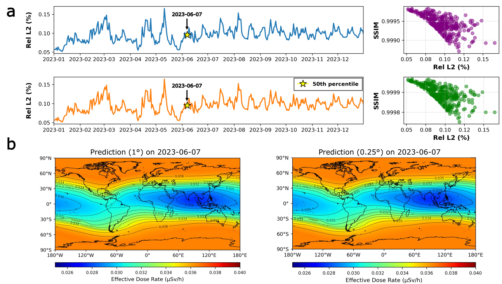

# TRON: Temporal Radiation Operator Network

## Executive Summary

The Temporal Radiation Operator Network (TRON) represents a method in real-time environmental field reconstruction, demonstrating how spatiotemporal neural operators can infer continuous global scalar fields from sparse, indirect observations. This work addresses a fundamental challenge across scientific domains: reconstructing high-resolution spatial fields from limited sensor data without relying on computationally expensive physics-based simulations. Applied to global cosmic radiation dose mapping, TRON achieves sub-0.1% relative error compared to physics-based method, enabling real-time operational monitoring for aviation safety, space missions, and public health risk assessment.

### The Cosmic Radiation Problem

Cosmic radiation exposure presents an exemplary test case for this challenge. Galactic cosmic rays interact with Earth's atmosphere to produce extensive air showers of secondary particles, creating a complex radiation field that varies with solar activity, geomagnetic conditions, and atmospheric properties. 

Traditional assessment relies on physics-based simulations (e.g., EXPACS/PARMA using the PHITS Monte Carlo code) that model atmospheric cascades from primary cosmic rays through particle interactions to dose deposition. While accurate, these simulations require hours to compute global fields for a single time point, precluding real-time operational use.

TRON reformulates this challenge as a spatiotemporal operator learning problem: given sparse, time-varying neutron monitor observations (indirect proxies of radiation exposure), reconstruct the continuous global effective dose field in real time. This problem is markedly ill-posed—inferring 65,341 spatial field values from only 12 point measurements at each time step represents an extreme underdetermined system where the solution space vastly exceeds the constraint dimensionality.

### Datasets
All processed datasets and benchmark results are available from [Drive](https://drive.google.com/drive/folders/18zLrB9i0R8bwZGvyRDaoOualiUMOL30f?usp=sharing).

1. neutron_data_22_yrs.npy
- The neutron sensor data (2001-2023). The dataset contains the daily neutron counts (count/s) over 23 years between 2001-01-01 and 2023-12-31.
- The tag '22' in the filename is a typo, so please ignore.

2. dose_array.npy
- The solution data corresponding to the neutron sensor data. 
- It was prepared with EXPACS (developed by Japan Atomic Energy Agency) and the spatial resolution was set to 1 deg in lat and lon. 

3. DoseNumpy025
- High spatial resolution solution datasets prepared with 0.25 spatial resolutions in lat and lon.
- This dataset was used for the study of zero-shot capability.

4. add_sensor
- The additional neutron sensor data for the robustness check for adding new sensor.
- The duration is the same as the neutron_data_22_yrs.npy, but new sensor location (MXCO).

### Data Usage Terms
If you use these datasets for your work, please confirm the terms of data usage from the original sources:

EXPACS (Japan Atomic Enargy Agency) [https://phits.jaea.go.jp/expacs/]

NMDB: the Neutron Monitor Database  [https://www.nmdb.eu/]

## Citation
If you use this repository, datasets, or pretrained models, please cite:

> **Kobayashi, K., Roy, S., Koric, S., Abueidda, D., and Alam, S. B.**  
> *From Proxies to Fields: Spatiotemporal Reconstruction of Global Radiation from Sparse Sensor Sequences.* 
> **arXiv:2506.12045**, 2025.